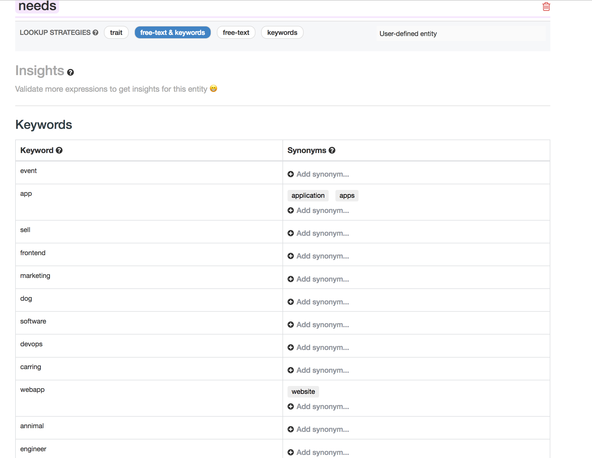

If you want to try or use the bot you should follow those step:
**warnings: it has been done in a hackathon some rework should be made for production ready**
# example of conv

# how to deploy
## get the project
`git clone https://github.com/AyWa/F8_hackathon_helpies`
## server
You need to deploy the node js index. The easiest way is to use heroku.
Create an account. (you need to install the CLI and setup) https://devcenter.heroku.com/articles/heroku-cli   
then:
```
heroku create
git push heroku master
```
## setup heroku env variable
We need to set 4 differents env variable in heroku.
You can go to your heroku project settings and create those differents env variable:
 - PAGE_ACCESS_TOKEN
 - VERIFICATION_TOKEN
 - WIT_TOKEN
 - WEBHOOK
 - DB   
like:   

**We will set those value in next step.**

## DB
please create a firebase real time DB https://firebase.google.com/docs/database/

then set the env `DB` in heroku with you url. (it should be something like https://something.firebaseio.com/)

## FB config
### enable greeting
in your facebook page. Go to `settings/messaging` and enable `Show a Messenger greeting`
### bot config
- go to https://developers.facebook.com/ and create a project for your page
- go to messenger
- click on token generation.
- set the token in heroku (for `PAGE_ACCESS_TOKEN` env)
- then create WEBHOOK
- in the callback URL field you should set your heroku url like `https://f8helpies.herokuapp.com/webhook` dont forget the `/webhook`
- the Verify Token you can put whatever you like. You just need to set it in heroku (`WEBHOOK` env)

## Natural language processing
you need to go to `https://wit.ai/` an create an account and an app.
You need to create 2 different entities
`needs` and `wit/location` like: 
you might need to train them like:


**Choose the correct lookup strategies free-text & keywords for needs**
Then you can put your token to the heroko env variable `WIT_TOKEN`

## Test
You can go back to your facebook page
click on send message / test the button
like:   
like: 
then click on get started
